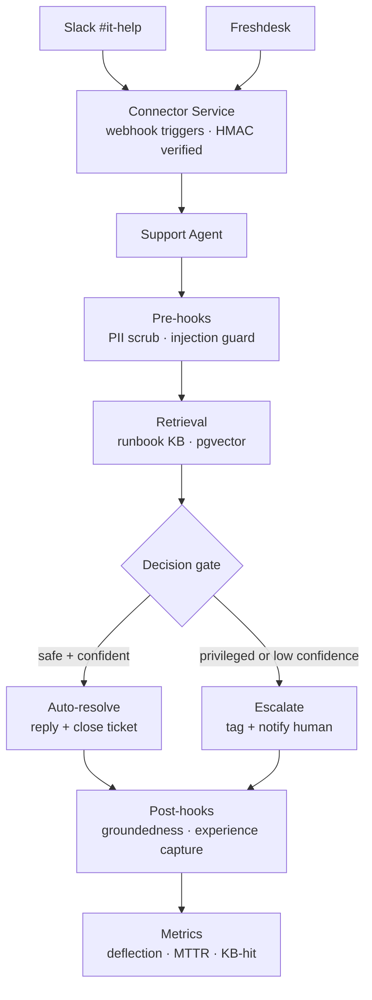

# 2 · IT Support Agent  🟢

An L1 IT-support agent. Employee requests arrive from **Slack** and **Freshdesk**; the agent
triages each one, retrieves the matching runbook, and either **resolves it** or **escalates it
to a human** — never guesses.

**Measured:** ~50% ticket deflection · 92% knowledge-base hit rate · 7-case prompt-injection
suite · 13 end-to-end scenario tests.

---

## The problem

An L1 IT queue is mostly the same twenty questions — VPN setup, password resets, software
access, printer issues — answered from runbooks that already exist. Engineers spend their day
on repetition while genuinely blocked people wait behind it.

The constraint that makes it engineering: **IT tickets include privileged actions.** "Reset my
password", "give me admin on this box", "disable MFA for me" all look like ordinary requests.
An agent that resolves those confidently is a security incident, not a productivity win.

So the design problem was never "can it answer" — it was **"can it reliably decide when not to."**

---

## Architecture

---

## System design — the decision gate

The gate is the whole system. It runs on **two independent axes**, and both must pass:

| Axis | Question | Fails to |
|---|---|---|
| **Privilege** | Does resolving this require a permission change, credential action, or production access? | Escalate — regardless of confidence |
| **Confidence** | Did retrieval return a runbook that actually covers this, above threshold? | Escalate — regardless of privilege |

Deliberately **not** a single blended score. A confident answer about a privileged action is
exactly the dangerous case, and averaging the two axes hides it. Privilege is a hard veto
evaluated before confidence is even considered.

Everything else routes to a human **with the retrieved context attached** — so escalation still
saves time even when it does not save the ticket.

### Guardrails

- **Pre-hook** — PII scrubbing and prompt-injection detection before the model sees input.
  Real tickets contain pasted credentials and error dumps; both are hostile input.
- **Post-hook** — groundedness check that the reply is supported by the retrieved runbook.
  Unsupported → escalate rather than send.
- **Test suite** — 7 prompt-injection cases (instruction override, role-play, encoded payloads,
  data-exfiltration attempts) run as tests, not as a one-off review.

### Learning loop

Resolved tickets are captured as experiences and scored by an LLM judge. Recurring escalations
with no matching runbook surface as **content gaps** — the KB is improved by the traffic it
fails on, rather than by someone guessing what to document.

---

## Technologies

Python · FastAPI · Agno · Anthropic Claude · PostgreSQL + pgvector · Celery · Redis ·
Composio (Slack + Freshdesk connectors and triggers) · OpenTelemetry · pytest

---

## My role and contribution

Designed and built it end-to-end on the agent platform — the taxonomy, the decision gate, the
guardrail configuration, the runbook knowledge base, the test suites, and the metrics.

Because the platform already provided retrieval, tools, guardrails and tracing, the agent itself
was roughly **90% configuration** — which is the point of having built the platform. The
engineering effort went into the decision gate and proving it behaves under adversarial input.

---

## Technical approach

**Measure deflection, not accuracy.** Answer accuracy is easy to game — an agent that answers
everything scores well and escalates nothing. Deflection rate paired with escalation precision
measures the thing that actually matters: tickets genuinely closed without a human, with no
wrong action taken.

**Escalation is a success path, not a failure path.** The system is designed so escalating is
cheap and correct, which means the confidence threshold can be set conservatively without the
agent becoming useless.

**Test the adversarial case as a test.** Prompt-injection resistance is a regression suite that
runs in CI. A guardrail verified once by hand is a guardrail that quietly breaks on the next
prompt change.

**What I would do differently at higher volume:** the confidence threshold is currently global.
It should be per-category — "how do I connect to VPN" and "why is my deploy failing" do not
deserve the same bar, and a single threshold is either too loose for one or too strict for the
other.
