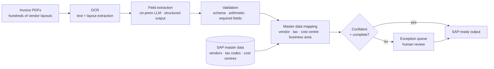

# 3 · Invoice → ERP Automation  🟢

Accounts-payable invoices to SAP-ready output for a **large pharma manufacturer**. PDFs arrive
from hundreds of vendors in every conceivable layout; the system extracts them, maps them to the
customer's own master data, and produces a validated import file — with a human reviewing only
the exceptions.

Built on a **private on-premise model**. No invoice ever leaves the customer's network.

---

## The problem

An AP clerk reads an invoice and types it into SAP. The typing is not the hard part — the
**mapping** is. Every line has to resolve to the customer's internal codes: vendor code, tax
code, cost centre, business area. Those codes are not on the invoice. They live in SAP master
data, and getting one wrong posts money to the wrong place.

Two constraints shaped everything:

1. **Data could not leave the network.** Pharma, commercially sensitive supplier pricing — no
   external model APIs. This was a hard requirement, not a preference.
2. **Wrong is worse than slow.** A hallucinated cost centre is a financial posting error found
   at month-end close, not a typo someone notices.

---

## Architecture

---

## System design — the part that matters

### Grounding against structured master data, not documents

This is the design decision that makes the system correct, and it is the opposite of a standard
RAG build.

Vector search over documents is the right tool for *"what does our travel policy say about
business class"* — a question with a discussable answer. It is the **wrong** tool for *"what is
this vendor's code"*, which has exactly one right answer sitting in a database table.

So the pipeline splits by question type:

| Step | Question | Method |
|---|---|---|
| Extraction | "What does this invoice say?" | LLM reading the document — genuinely ambiguous layout, model is the right tool |
| Mapping | "What is this vendor's code in SAP?" | **Deterministic lookup + fuzzy match against master data**, model proposes only when the match is ambiguous |
| Validation | "Does this add up?" | Arithmetic and schema checks — no model involved |

The model is used where language is ambiguous, and kept away from anything with a single correct
answer that a database already knows. **Most hallucination risk is removed by not asking the
question.**

### What is deliberately not automated

**GL account selection is left manual.** It is technically the easiest field to predict —
strongly correlated with vendor and description, and a model would score well on it.

It stays manual because it is **accounting judgement, not extraction**. The same expense can
land in different GL accounts depending on capitalisation policy, period, and treatment
decisions that live in the finance team's heads and change. High model accuracy on a judgement
call produces confident, plausible, wrong postings — the most expensive kind of error, because
nobody reviews what looks right.

Automating it would have demoed better and been worse.

### Exception routing

Anything below threshold, unmatched against master data, or failing validation goes to a review
queue **with the source document, the extracted values, and the candidate matches shown side by
side**. The human decides in seconds rather than re-reading the invoice — that framing is what
made the review queue acceptable to the AP team rather than an extra step they resented.

---

## Technologies

Python · on-premise LLM (self-hosted, no external API calls) · OCR / layout extraction ·
structured output validation · SAP master-data integration · PostgreSQL · Docker

---

## My role and contribution

Designed the pipeline architecture and the grounding strategy, built the extraction and mapping
stages, defined the confidence and exception model, and ran the discovery with the finance team
that determined which fields were safe to automate and which were not.

The discovery was the highest-value part. The initial brief was "automate invoice processing."
The useful version was **"automate extraction and mapping, and route judgement to humans"** —
which came out of asking the AP team what a wrong value would actually cost, field by field.

---

## Technical approach

**Choose the tool per question, not per project.** One pipeline uses an LLM, fuzzy matching, and
plain arithmetic — each where it is strongest. Picking a favourite technique and applying it
everywhere is how RAG systems end up hallucinating vendor codes.

**Design for the error cost, not the accuracy score.** Fields were classified by what a wrong
value costs: a misread invoice number is a nuisance, a wrong cost centre is a financial
misposting. Automation thresholds follow the cost, not the model's confidence.

**On-premise as an architectural constraint, not a limitation.** No external APIs meant no
frontier-model quality, so accuracy had to come from structure — validation layers, deterministic
mapping, and a tight exception path — rather than from a better model. That constraint produced
a more auditable system than the cloud version would have been.
