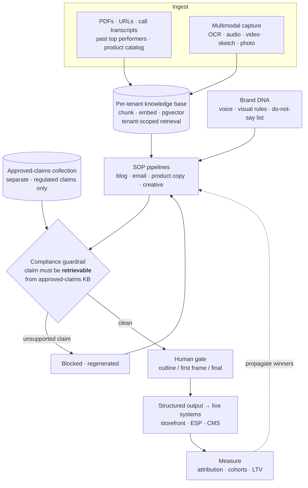

# 4 · Compliance-Gated Content Engine  🟢

A growth platform for **direct-to-consumer health and wellness brands** — blogs, email
sequences, product copy, ads and video, produced at the volume of a full marketing team.

The interesting constraint is not the generation. It is that these brands sell in a **regulated
claims category**, where one confident sentence is a legal exposure.

**Outcome:** roughly **10× content throughput at flat headcount**, blog cycle time from days to
a single day, sustained output of **45–50 videos and 30–40 images per month**, and — the part
the client cared about most — **compliance review load dropped**, because unapproved claims were
filtered out before a human ever saw them.

---

## The problem

> Give a small brand the content output of a ten-person marketing team — **without ever
> publishing a health claim it is not legally allowed to make.**

Two constraints, and the second is the one that makes this engineering rather than a wrapper.

Wellness and Ayurveda claims are regulated (AYUSH in India, FTC/FDA equivalents elsewhere). A
model that writes *"clinically proven to cure X"* has not made a copy error — it has created
liability. And the failure is invisible: the sentence is fluent, on-brand, and looks exactly
like copy that would be fine.

The naive control is a system prompt: *"never make unapproved health claims."* That is not a
control. It asks the model to know a legal boundary it has no reliable knowledge of, and it
fails silently.

---

## Architecture — one brand brain, many surfaces



Sold as several products; architecturally it is **one thing** — a per-brand corpus plus brand
and compliance rules, feeding many generation surfaces, pushed into the brand's live stack and
measured back.

---

## System design

### 1 · Compliance as retrieval, not instruction

**The single most important decision in the system.**

Permitted claims live in a **separate collection** from the brand corpus. A generated claim
survives into copy only if it is **retrievable from that collection**. Not softened, not flagged
for later — blocked and regenerated.

This reframes hallucination control from a prompting problem into a **retrieval and citation
problem**, which is testable. And the logic is inverted from the obvious design: the system does
not detect bad claims (an open-ended problem that fails open) — it **permits only known-good
ones** (a closed problem that fails shut).

Keeping approved claims in their own collection rather than mixed into the brand corpus matters
too: it means the compliance check cannot be satisfied by the brand's own past marketing copy,
which is exactly where non-compliant phrasing tends to already exist.

### 2 · SOP pipelines, not single prompts

Each surface runs a multi-step standard operating procedure. The long-form pipeline:

```
context → keyword + intent research → format selection → semantic clustering
        → OUTLINE  ──[ human approves ]──►  draft → compliance self-check
```

**Semantic keyword clustering** groups target keywords into topical clusters so the brand builds
authority without cannibalising its own pages. It runs on embedding clustering — no LLM call,
so it is effectively free at volume.

### 3 · The human gate goes at the outline

Deliberate, and it is a cost decision as much as a quality one.

Correcting direction at the outline costs one cheap call. Correcting the same mistake after a
2,000-word draft costs a full regeneration plus editor time. Reviewing an outline takes a minute
and invites judgement; reviewing a finished article takes twenty and invites line-editing.

Gate placement is a design decision, not an afterthought.

### 4 · Structured output wired into live systems

Output is not chat text. It is typed fields that land in real systems:

| Surface | Contract |
|---|---|
| Product copy | Storefront / PIM fields, three lengths — marketplace short, site long, meta |
| Email | Subject · preview · body blocks · CTA → pushed to the brand's ESP |
| Blog | H1/H2 structure, meta description, internal product links |

Schemas map 1:1 to the destination fields, which raises the stakes on validation: **schema drift
breaks the publish path, not just the text.** Structured output plus a connector layer is what
makes this operational rather than a demo.

### 5 · One corpus, N surfaces

The same knowledge base and the same voice profile drive blog, email, product copy, social, ads
and video. The marginal cost of a new content surface is **a new SOP, not a new system**.

This is the honest answer to "what did AI actually buy you": it bought **consistency at
fan-out** — which is the first thing human teams lose when they scale output.

### 6 · Closing the loop

The creative pipeline's final step is *measure and propagate* — scale what won, cut what did
not. Attribution and cohort data feed back into what gets generated next.

Most content tools stop at generation. The loop is the difference between a generator and a
system.

---

## The genuinely hard parts

| Problem | Approach |
|---|---|
| **Multi-tenant isolation** | Brand A's corpus must never surface in Brand B's copy. Tenant scoping is enforced at the retrieval boundary, **below the agent** — not in the prompt. Isolation you can forget to apply is not isolation. |
| **Compliance enforcement** | A claim must resolve to an approved-claims chunk. A system-prompt instruction is guidance; a retrieval requirement is a gate. |
| **Keyword cannibalisation** | Semantic clustering over embeddings, no LLM — cheap enough to run on every brief. |
| **Gate placement** | Outline-stage, for the cost asymmetry above. |
| **Output contracts** | Pydantic schemas mapped to destination fields; validation failure blocks publish rather than shipping malformed copy. |
| **Cost at volume** | 10× content is 10× tokens. **Model routing** — small model for clustering, outlines and classification; strong model for prose and the compliance critic. **Brand-DNA prefix cached** across every call for a tenant, since it is identical on every request. |

---

## Technologies

Python · Agno · Anthropic Claude · OpenAI · PostgreSQL + pgvector · Celery · Redis ·
embedding-based semantic clustering · multimodal generation (video, image) · structured output
with Pydantic contracts · connector integrations to commerce platforms, ESPs and CRMs ·
OpenTelemetry

---

## My role and contribution

I architected the platform this runs on and designed the content system on top of it: the
per-tenant knowledge model, the approved-claims guardrail, the SOP pipelines with their human
gates, the structured output contracts, and the connector delivery path.

**Scope discipline.** What I am claiming here is the knowledge base, the generation pipelines
(blog, email, product copy), the creative engine, and multimodal ingestion. The same product
also ships a customer-data platform, storefront components and analytics — those are
conventional software, not AI work, and they are not my claim.

---

## Technical approach

**Constrain the output space rather than instructing the model.** Where a mistake has legal
consequences, the control must be structural. Only one of "a prompt instruction" and "an
allow-list check" fails safely.

**Ground in the brand's own corpus.** Retrieval over what the brand has already published makes
voice consistent by construction, rather than approximating it with tone instructions.

**Put the human where their judgement is worth the most** — at the decision point that changes
the most downstream work, not on every output.

### On measuring quality honestly

Throughput is not quality, and the tempting metrics here are lagging ones. "Ranks and converts"
cannot gate a publish — it arrives weeks later and is confounded by everything else the brand
is doing.

The metrics that actually gate the system are **groundedness** (does each claim resolve to a
source chunk), **brand-voice adherence**, **compliance rejection rate**, and above all **human
edit rate** — what fraction of generated copy ships with a light edit versus a full rewrite.
Edit rate is the number that tells you whether the system is working.

Revenue figures exist for this client — automated email sequences drove five-figure attributable
sales — but email performance depends on list quality, offer and timing as much as on copy, so
I would attribute those to the programme rather than to the generation engine specifically.

### What I would build next

The measurement layer knows which content earned revenue, but nothing acts on it automatically —
a human still reads the dashboard and decides. The obvious next step is an analytics agent over
that data that **proposes what to generate next**, closing the loop without a person in the
middle. Right now the loop exists but a human is still the wire.
