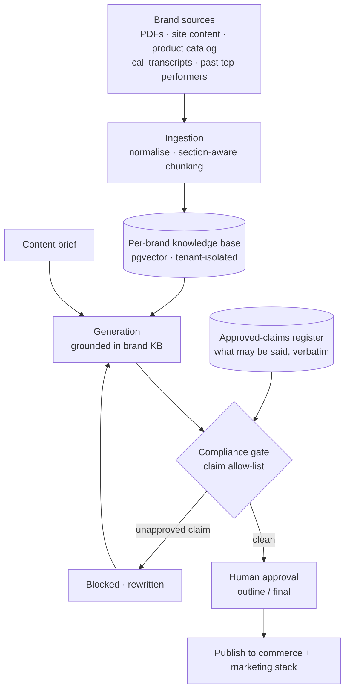

# 4 · Compliance-Gated Content Generation  🟢

A content system for a **direct-to-consumer health and wellness brand** — blogs, email
sequences, product copy and creative, generated at the volume of a full marketing team.

The engineering is not the generation. It is that the brand operates in a **regulated claims
category**, and a single sentence that says the wrong thing is a legal exposure.

---

## The problem

Wellness and Ayurveda claims are regulated. A model that writes *"clinically proven to cure X"*
has not made a copy error — it has created liability. And the failure is invisible: the sentence
reads fluently, matches brand tone, and looks exactly like acceptable copy.

So the requirement had two halves, and the second is the one that makes it a system rather than
a wrapper:

> Produce the content output of a ten-person marketing team — **without ever publishing a health
> claim the brand is not legally permitted to make.**

---

## Architecture

---

## System design

### An approved-claims register, not a prompt instruction

The naive approach is a system prompt: *"never make unapproved health claims."* That fails,
because it asks the model to know a legal boundary it has no reliable knowledge of, and it fails
silently.

Instead the permitted claims are an explicit **register** — a maintained list of what the brand
is allowed to say, in approved phrasing. Generated content is checked against it. A claim that
is not on the list does not get softened or flagged for later; it is **blocked and regenerated**.

The inversion matters: the system does not detect bad claims (an open-ended problem), it
**permits only known-good ones** (a closed one). Allow-lists fail closed; deny-lists fail open.

### Per-brand knowledge base

Every brand's own material — product catalogue, past high-performing content, brand guidelines,
call transcripts — becomes a **retrieval corpus, not a prompt**. Generation is grounded in it,
which is what separates a content system from an AI writer: output is consistent with what the
brand has actually said before, and tenant isolation is enforced at retrieval.

### Human gates at the cheapest point

The long-form pipeline runs: context → keyword and intent research → format selection →
semantic clustering → **outline (human approves)** → full generation.

The approval sits at the **outline**, not the finished draft. Reviewing an outline takes a
minute and catches direction errors before generation cost is spent; reviewing a finished
3,000-word article takes twenty minutes and invites line-editing rather than judgement.
Gate placement is a design decision, not an afterthought.

---

## Technologies

Python · Agno · Anthropic Claude · OpenAI · PostgreSQL + pgvector · Celery · Redis ·
multimodal generation for creative · connector integrations to the brand's commerce and email stack

---

## My role and contribution

Architected the platform layer this runs on and designed the compliance gate, the per-brand
knowledge model, and the multi-step content pipeline with its human approval points.

**Scope note:** the surfaces I am describing are the knowledge base, the generation pipelines
(blog, email, product copy), the creative engine, and multimodal ingestion. The same product
also ships analytics and storefront components that are conventional software, not AI — those
are not my claim here.

---

## Technical approach

**Constrain the output space rather than instructing the model.** Where a mistake has legal
consequences, the control has to be structural. Prompt instructions are guidance; an allow-list
check is a gate. Only one of them fails safely.

**Ground in the brand's own corpus.** Retrieval over what the brand has already published makes
output consistent by construction, instead of relying on tone instructions to approximate a
voice.

**Put the human where their judgement is worth the most.** Not on every output — at the point
where a decision changes the most downstream work.

**What I would strengthen:** the claims register is maintained manually. At more brands it needs
an ingestion path from the regulatory source itself, with expiry dates on claims, so it cannot
quietly drift out of date while the system keeps trusting it.
