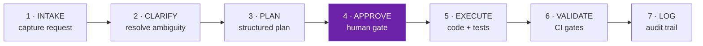

# 6 · AI Development Lifecycle — a governance framework  🟢

A framework I designed and rolled out so an enterprise API team could use AI coding assistants
at full speed **without losing traceability, review discipline or security control**.

Not a tool. A lifecycle, with the governance rules stored in the repository next to the code.

---

## The problem

AI coding assistants arrived in the team faster than any process for them. The symptoms were
consistent and got worse as adoption grew:

| Without a framework |
|---|
| AI writes code — nobody knows why the decisions were made |
| Security review skipped under deadline pressure |
| No traceability between work items and merged code |
| Tests deferred to "later", which never arrives |
| Plans agreed verbally, never written down |
| Rollback steps unclear when production breaks |
| Every developer using a different AI workflow |

The core issue is not code quality — assistants write reasonable code. It is that **the reasoning
disappears**. A reviewer sees a diff with no record of what was considered, what was ruled out,
or what the author was told not to touch.

---

## The framework

### Seven phases — every feature, same sequence

| Phase | Who | Output |
|---|---|---|
| **1 · Intake** | Developer + AI | Structured record; security flag raised automatically if the work touches auth, secrets, migrations or the API contract |
| **2 · Clarify** | AI asks | *All* questions at once — scope, behaviour, data, security, testing. Assumptions stated explicitly and corrected by the team before proceeding |
| **3 · Plan** | AI generates | Allowed scope, **blocked scope**, risk level, ordered steps, **rollback path** |
| **4 · Approve** | **Human** | 🚪 **Gate — no code is written before this passes** |
| **5 · Execute** | Developer + AI | Code and tests in the same pull request |
| **6 · Validate** | CI | Build, tests, coverage, security scan, structure check |
| **7 · Log** | AI generates | Audit trail written into the PR body automatically |

Phases 1–3 use AI freely. Phase 4 is a mandatory human gate. Phases 5–6 use AI **within approved
scope only**. Phase 7 produces the record.

### Phase 3's most important field: blocked scope

Most planning formats list what will be done. This one also states **what the assistant must not
touch** — pipelines, auth, unrelated modules. Naming the boundary explicitly is what makes
Phase 5 reviewable: a diff outside declared scope is a visible violation, not a judgement call.

And every plan carries a **rollback path** before any code exists. Writing the undo while calm
is a different activity from writing it during an incident.

### Approval scales with risk

| Risk | Triggers | Approvers |
|---|---|---|
| **Low** | New read endpoints, minor config | Tech Lead |
| **Medium** | New database column, migration, new route | Tech Lead + Platform |
| **High** | Auth, secrets, public API contract change | Tech Lead + Platform + Security |

A single approval bar is either too heavy for a config tweak or too light for an auth change.
Tiering it is what stops the gate being routed around.

### What is automated, gated, and never automated

| ✅ Always automated | 🚪 Requires a human | ⛔ Never automated |
|---|---|---|
| Build and test execution | Plan approval before coding | Auth / JWT / claims changes |
| Coverage calculation | Medium-risk changes | Secrets or key vault changes |
| Dependency CVE scanning | Security-critical code | CI/CD pipeline modification |
| PR template validation | Database migrations | Approving your own PR |
| Lint and format | New public API routes | Bypassing CI |
| Audit trail generation | New external connectors | Hard deletes on production data |
| | Non-trivial architecture decisions | Force-push to main |

**The right-hand column is the most important part of the framework.** Deciding what AI is
*never* permitted to do — even when it would do it well — is the decision that makes the rest
safe to relax. It is also the column that gets skipped when frameworks are written by people
optimising for adoption metrics.

### Three scoped AI pipelines

Each configured with explicit capabilities **and explicit prohibitions**:

| Pipeline | Can | Cannot |
|---|---|---|
| **Work-item query** | Read work items, sprint status, velocity, blockers | Create, update, assign, comment, or close anything |
| **PR review** | Read diffs, classify risk, comment on security and architecture, suggest test gaps | Approve, push commits, bypass branch protection, review as a named person |
| **Internal Q&A** | Query approved read-only data sources and knowledge bases | Write to any source, reach unapproved services, unrestricted internet |

Read-heavy, write-narrow. Every pipeline states its prohibitions in configuration, so the
boundary is reviewable rather than assumed.

### The audit trail

Phase 7 writes into the pull request automatically: linked work item, risk level, model used,
tools used, **decisions made and why**, assumptions, security impact, rollback path.

This is the piece that solved the original problem. The reasoning that used to evaporate now
lives permanently next to the diff — reviewable at review time, and still there a year later
when someone asks why.

---

## Technologies

AI coding assistants (Claude) · Git + PR templates · CI/CD pipelines · automated security and
dependency scanning · coverage gates · work-item tracking integration · governance rules stored
as version-controlled files in the repository

---

## My role and contribution

I designed the framework, wrote the governance files, built the pipeline configurations, and ran
the rollout — including the session that took the whole engineering team through it, and the
per-role guidance for developers, tech leads, QA and product.

Rollout was staged deliberately: brief the tech leads first, then one low-risk feature end-to-end
as a team walkthrough, then enable the automated PR review, then calibrate risk levels together
after the first sprint. Governance that arrives as a mandate gets routed around; governance the
team calibrates itself gets used.

---

## Technical approach

**Put governance in the repository, not in a wiki.** Rules that live next to the code are read,
versioned, reviewed and diffed. A policy document in a separate tool is read once.

**Gate the plan, not the code.** Reviewing a plan takes minutes and catches direction errors
before effort is spent. Reviewing a large AI-generated diff invites line-editing rather than
judgement, and by then the expensive mistake has already been made.

**AI assists, humans are accountable.** Nobody may say "the AI wrote it." The author owns every
line they commit — which is precisely why the plan gate and the scope boundary have to exist.

**Make the audit trail a by-product.** Documentation that requires extra effort does not survive
a deadline. This one is generated automatically as a phase of the workflow, so the trail exists
even in the sprints where nobody has time to care about it.
