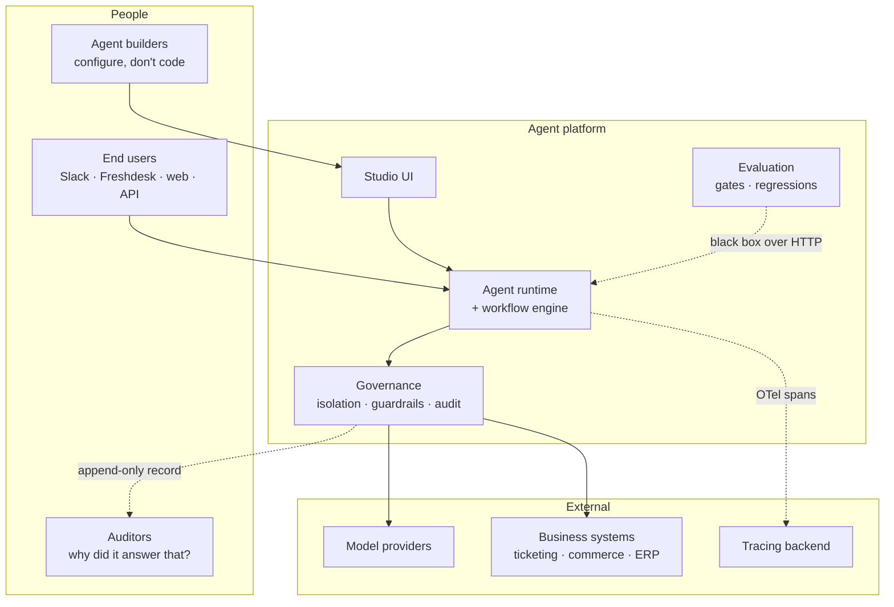

# Diagrams

Diagrams live **inline, next to the text they explain**, as Mermaid — one source that
renders in GitHub, and stays diffable in review rather than becoming a binary that drifts
out of date with the system it describes.

| Diagram | Where |
|---|---|
| Platform service topology | [`platform/architecture.md`](../platform/architecture.md) |
| Agent execution sequence | [`platform/architecture.md`](../platform/architecture.md) |
| One run end to end, with failure branches | [`platform/runtime-sequence.md`](../platform/runtime-sequence.md) |
| Seven-phase development lifecycle | [`platform/ai-development-lifecycle.md`](../platform/ai-development-lifecycle.md) |
| Support agent decision gate | [`case-studies/01-it-support-deflection.md`](../case-studies/01-it-support-deflection.md) |
| Invoice extraction and grounding | [`case-studies/02-invoice-to-erp-grounding.md`](../case-studies/02-invoice-to-erp-grounding.md) |
| One brand brain → many surfaces | [`case-studies/03-compliance-gated-content.md`](../case-studies/03-compliance-gated-content.md) |

The system context diagram below is the only one that does not belong to a single document.

