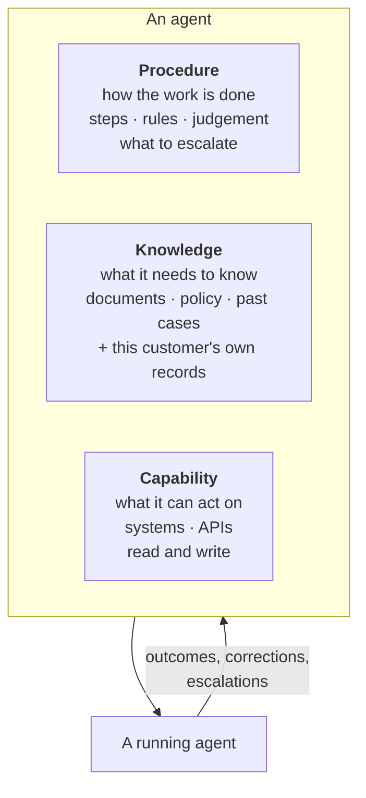
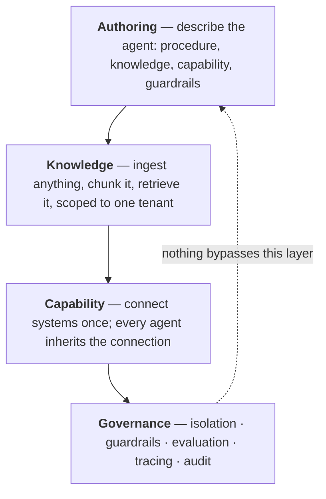

# The platform — the concept  🟢

A multi-tenant platform for building, running and governing AI agents. **Used by multiple
organisations.** Every case study in this repo runs on it.

This page explains the *idea*. [`architecture.md`](architecture.md) explains how it is built.

| | |
|---|---|
| [`architecture.md`](architecture.md) | Service decomposition, data model, workflow engine |
| [`runtime-sequence.md`](runtime-sequence.md) | One agent run end to end, with its failure branches |
| [`ai-development-lifecycle.md`](ai-development-lifecycle.md) | The governance framework the team builds *with* |
| [`decisions/`](decisions/) | Architecture decision records, and their expiry conditions |

---

## The problem

Ask an organisation how a piece of work actually gets done and you get three different
answers from three people. The real procedure lives in somebody's head, refined over years
and never written down. The information it depends on is spread across a document store, a
wiki, a CRM and an inbox. The systems it has to touch each have their own login.

So work that is *conceptually* routine stays manual, because the only thing that could
automate it is a person who holds all three of those in their head at once.

The instinct is to build software for each case. That fails on economics rather than on
capability: every workflow needs a project, the project takes months, and by the time it
ships the procedure has moved on. Most workflows are never worth a project, which is exactly
why they are still manual.

---

## The central idea

**An agent is not a program. It is the composition of three things a person would need to
do the same job.**



Onboarding a new colleague follows the same three steps. You explain how the work is done,
give them access to the information, and grant them permissions on the systems. Nobody
writes them a bespoke application.

Once an agent is expressed that way, **building one stops being a software project and
becomes a description**. That is the whole thesis of the platform, and everything in it
follows from taking that seriously.

### The three, precisely

| | What it captures | Who owns it | How often it changes |
|---|---|---|---|
| **Procedure** | The steps, decision rules, tone, and — most importantly — **where it must stop and ask a human** | The person who does the work today | Constantly |
| **Knowledge** | Everything specific to *this* tenant — the document corpus it reasons over (policy, prior cases, product docs) **and** the structured records that make output theirs rather than generic (customer history, catalogue rows, entitlements). Retrieved per request, never memorised into the model | A domain or content owner | Continuously |
| **Capability** | Tools it may invoke, scoped and permissioned. Read-heavy, write-narrow by default | Platform and security | Rarely |

They are separated because **they are owned by different people and change at different
rates.** Fusing them into one artifact — which is what "just write the agent in code" does —
means a procedure change becomes a code change, and the person who understands the procedure
is not the person who can deploy it.

That coupling is the actual reason internal automation projects stall. Splitting the three is
what makes the platform useful rather than merely convenient.

---

## What the platform is, then

If an agent is those three things, the platform is **everything else** — and everything else
turns out to be most of the work.

The interesting part of any agent is the last 10%: its decision boundaries, what it is
allowed to do, when it must defer. The other 90% is retrieval, tool invocation, guardrails,
evaluation, tracing, tenant isolation, retries, and cost control. Every team rebuilds that
90%, and rebuilds it badly, because it is not the part they find interesting.

So the platform provides the 90% once, and a new agent becomes **configuration rather than a
codebase**.

The evidence that this works is in [`../case-studies/01-it-support-deflection.md`](../case-studies/01-it-support-deflection.md):
a production support agent that is roughly 90% configuration, where the engineering effort
went into its decision gate rather than into plumbing retrieval and tools for the fourth time.

---

## Four layers



**Authoring** turns a description into a running agent. Configuration is data, so an agent
can be versioned, reviewed, duplicated and rolled back — none of which is true of an agent
that exists as a script on someone's laptop.

**Knowledge** is where "what it needs to know" becomes retrievable: ingestion across formats,
chunking that respects document structure, hybrid search, reranking. Grounding an answer in a
retrieved source is what separates a system from a chatbot, and it is what makes an answer
checkable afterwards.

It covers two kinds of thing, and conflating them is a common design error. Unstructured
material — policy, guidelines, prior cases — is chunked and retrieved semantically. Structured
records — a customer's purchase history, a catalogue row, an entitlement — are looked up, not
searched. Both are this tenant's own data and both belong in this layer, but a question with
exactly one correct answer should never reach a similarity search.

**Capability** connects a business system once — authentication, permissions, rate limits —
and every agent inherits it. The alternative is each agent carrying its own integration code
and its own copy of the credentials.

**Governance is not a layer you can opt out of.** It sits underneath the others rather than
beside them: tenant scoping is enforced at the retrieval boundary so no agent configuration
can widen it, guardrails run on both sides of every model call, every run is traced, and
evaluation gates changes before release. An agent author cannot switch it off, because it is
not a setting they are offered.

---

## Two shapes of deployment

The same platform serves two quite different situations, and the difference is scope, not
capability.

**Organisation-wide.** Many agents sharing one knowledge base, one connector set and one
governance policy. The value compounds: the second agent is cheaper than the first because
the corpus and the integrations already exist.

**Single-purpose.** One agent doing one job well, deployed on its own for a narrow workflow.
Standing it up is a configuration exercise, so the economics work at a size that would never
justify a project.

Supporting both is a consequence of the three-part model rather than extra engineering. If an
agent is a description, the scope of a deployment is just how many descriptions you have.

---

## Agents are refined, not finished

The part most easily skipped, and the part that decides whether any of this survives contact
with production.

An agent's first version is wrong in ways nobody predicted, because the procedure in
somebody's head was never complete and the corpus never covered the real spread of requests.
So the loop matters more than the launch:

```
run  →  capture outcome  →  find the gap  →  update procedure or knowledge  →  run
```

Concretely, the signals that drive it:

- **Escalations** point at gaps. An agent that keeps escalating one category of request is
  telling you the corpus is missing something, not that it is failing.
- **Corrections** are training data for the procedure — where a human overrode the agent, and
  why.
- **Evaluation** stops the loop from being a slow regression: every change runs against golden
  sets with tiered gates, and every production failure becomes a permanent test case
  ([`../reliability/evaluation-harness/`](../reliability/evaluation-harness/)).

The third one is what makes the first two safe. Without it, "continuous improvement" is a
sequence of unmeasured prompt edits, each plausible, collectively a drift nobody can see.

---

## What it honestly is not

The workflow engine compiles a visual node graph into an executable runtime — agent nodes,
conditions, loops, parallel branches, tool calls, approval gates. It is **not a true DAG
scheduler**, and runs are **not resumable mid-execution**: a worker that dies takes its run's
progress with it.

The design that fixes it is built and tested in
[`../reliability/durable_workflow/`](../reliability/durable_workflow/), and the reasoning for
step checkpointing over a replay engine is in
[ADR 002](decisions/002-celery-redis-over-temporal.md).

Stating this is not a disclaimer. An architecture document that lists only strengths tells a
reader nothing about the author's judgement — the limits are where the judgement is visible.
