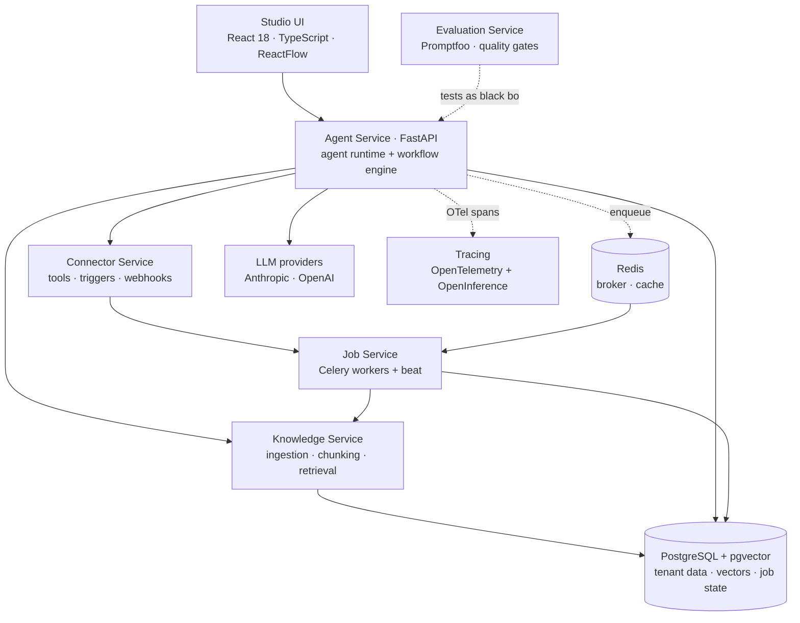
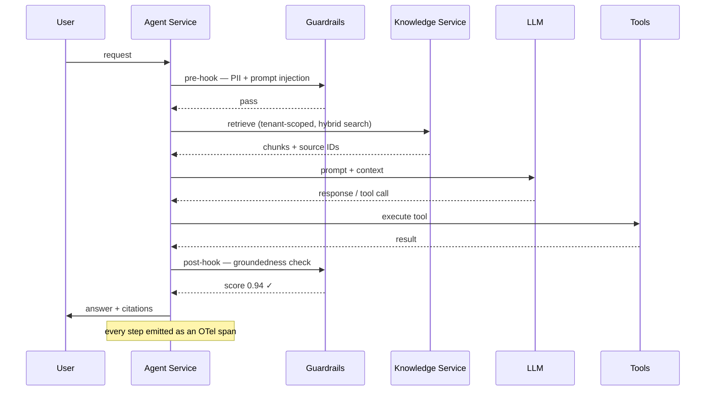

# 1 · Multi-Tenant Agent Platform  🟢

A platform for building, running and governing AI agents. Non-engineers configure an agent —
knowledge, tools, guardrails, workflow — through a studio UI; the platform compiles that into a
running agent with retrieval, tool access, evaluation and tracing already wired in.

Used by **100+ organisations**. Every project further down this repo runs on it.

---

## The problem

Every team wanted the same six things — retrieval over their own documents, tool access,
guardrails, evaluation, tracing, tenant isolation — and every team was rebuilding them from
scratch, badly. The interesting work is the last 10%: the domain logic. The other 90% is
infrastructure that should exist once.

So the design goal was: **make the 90% a platform, so a new agent is configuration rather than
a codebase.**

---

## Architecture



**Services split by failure domain, not by entity.** Ingestion can be saturated by a large
document upload without touching agent response latency. That separation is the reason the
split exists — not tidiness.

| Service | Owns | Why separate |
|---|---|---|
| **Agent Service** | Agent runtime, workflow execution, guardrail hooks | Latency-critical, must stay responsive |
| **Knowledge Service** | Ingestion, chunking, embedding, retrieval | Bursty CPU-heavy work |
| **Connector Service** | External tools, OAuth, inbound webhooks | Isolates third-party API failure |
| **Job Service** | Celery workers, scheduled jobs, learning loop | Long-running work off the request path |
| **Evaluation Service** | Datasets, scoring, CI quality gates | Treats every agent as a black box over HTTP |

---

## System design

### Nothing slow on the request path

```
POST /agents/{id}/run  ──► validate ──► enqueue ──► 202 + job_id
                                          │
                                       Redis
                                          │
                              Celery workers (routed queues)
                              ingest · index · agent · learning
                                          │
                                     PostgreSQL
                                          │
                              poll / webhook / WebSocket
```

Queues are routed per workload class so a slow bulk ingest cannot starve interactive agent
traffic — bulkhead isolation at the queue level. Worker concurrency and Gunicorn workers are
tuned per service.

### Agent execution



### Multi-tenancy

Tenant scoping is enforced at the **retrieval boundary**, not in application code. A governed
retriever applies the tenant filter on every query — so a caller that forgets to pass a tenant
ID gets nothing back, rather than someone else's documents. Isolation you can forget to apply
is not isolation.

### Workflow engine

Agents can be composed into workflows through a visual builder (ReactFlow) that compiles a node
graph into an executable runtime — agent nodes, conditions, loops, parallel branches, tool calls,
human approval gates.

**Honest limits:** it is a graph compiler over sequential primitives, not a true DAG scheduler,
and runs are not currently resumable mid-execution. The durable-execution design (step
checkpointing) is written up in [Reliability](../reliability/) and [ADR 002](decisions/002-celery-redis-over-temporal.md).

---

## Technologies

| | |
|---|---|
| **Backend** | Python, FastAPI, Celery, Gunicorn, Pydantic |
| **Agent framework** | Agno, with a platform layer on top for governance and workflow |
| **Data** | PostgreSQL, pgvector, Alembic, Redis |
| **Frontend** | React 18, TypeScript, Vite, Tailwind, ReactFlow, Recharts |
| **AI** | Anthropic Claude, OpenAI, multi-provider routing, hybrid search + reranking |
| **Ops** | Docker, Docker Compose, nginx, Azure, OpenTelemetry + OpenInference |

---

## My role and contribution

I architected and built the platform end-to-end — backend services, data model, agent runtime,
workflow engine, and the studio UI.

Specifically:

- **Service decomposition** — chose the failure-domain split above and the async job architecture
- **Multi-tenant data model** — schema, isolation strategy, migration path
- **Agent runtime** — guardrail hooks, tool dispatch, retrieval integration, streaming
- **Workflow engine** — visual graph to executable runtime compiler
- **Knowledge pipeline** — ingestion across formats, chunking strategy, hybrid retrieval
- **Evaluation service** — Promptfoo-based quality gates, described in section 5
- **Studio UI** — the full React/TypeScript front end, ~370 components
- **Production operations** — deployment, tuning, incident diagnosis

---

## Technical approach — three decisions worth explaining

**Docker Compose over Kubernetes.** Production runs Compose with Gunicorn multi-worker and
Celery workers on VMs. At current tenant count, the operational cost of Kubernetes was not
justified by the scaling benefit. The manifests, probe strategy and autoscaling design exist
and are documented — including the trigger condition for migrating. Choosing not to adopt
something is a decision that deserves writing down as much as adopting it.

**pgvector over a dedicated vector database.** Vectors live next to relational tenant data, so
retrieval filtering and access control are the same query — one datastore, one backup story, one
consistency model. The trade-off is ceiling: at very large index sizes a specialist store wins,
and that threshold is recorded.

**OpenTelemetry + OpenInference over a vendor SDK.** Instrumenting against the open standard
rather than a specific vendor means the tracing backend is a configuration choice — Phoenix
locally, Langfuse or Braintrust hosted — and switching is an exporter change, not a
re-instrumentation project.

### A production lesson

Most services run Gunicorn with multiple workers. One is deliberately pinned to a **single**
worker: it holds a WebSocket connection registry in process memory, and with two workers,
inbound webhook broadcasts reached only the clients connected to whichever worker handled the
webhook — so roughly half of live updates silently vanished.

Pinning to one worker fixed it and capped that service's throughput. The correct fix, designed
and scheduled, is to move the registry to Redis pub/sub so any worker can broadcast to any
client. It is a good example of the real failure mode in distributed systems: not a crash, but
**in-process state quietly breaking an assumption that horizontal scaling depends on**.
