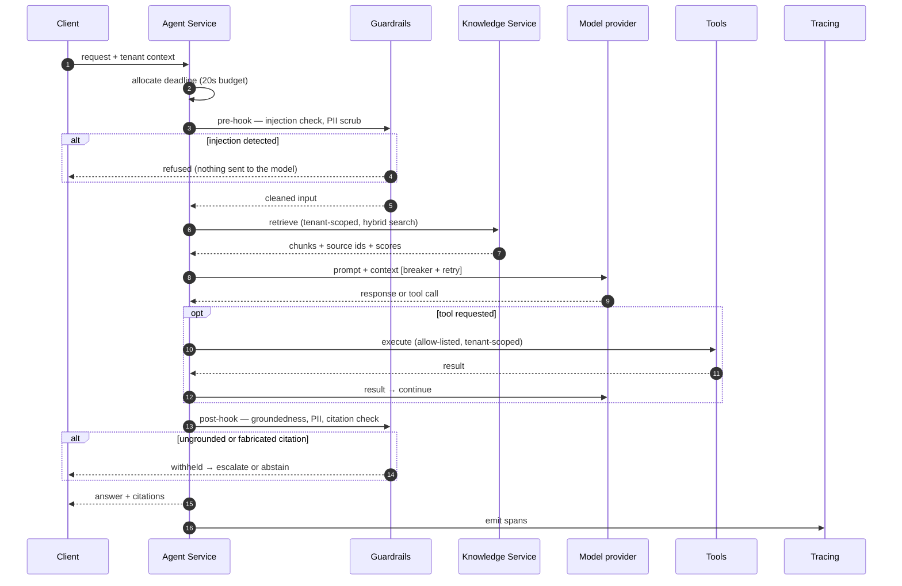

# One agent run, end to end  🟢

What actually happens between a request arriving and an answer being returned — and what
that looks like in a trace, which is the same thing viewed from operations.

---

## The path



---

## As a trace

Every step above is a span. This is what an operator sees, and it is also what makes the
answer explainable after the fact:

```
agent.run                                    2.4s   $0.011   tenant=acme
├── guardrail.input                           12ms  ✓ no injection · 1 PII value redacted
├── kb.search                                340ms  → 5 chunks [runbook-12 0.89, ...]
├── llm.generate                             1.8s   claude-sonnet · prompt v14
│                                                   1,240 in / 380 out · attempt 1/3
├── tool.freshdesk_reply                     180ms  ✓ idempotency-key=run-8891:reply
└── guardrail.output                          90ms  groundedness 0.94 · 2 citations ✓
```

**Read it as a bill of materials for the answer.** Which sources were retrieved and with
what scores, which prompt version ran, how many tokens it cost, whether a retry happened,
and whether the output check passed. A support question three weeks later — *"why did it
say that?"* — is answered from this, not from a reconstruction.

---

## Where each control sits, and why there

| Stage | Control | Why at this point |
|---|---|---|
| Entry | **Deadline allocated once** | Per-call timeouts each look reasonable and sum to minutes. One budget, decremented per hop. |
| Pre-hook | **Injection check** | Before the model sees anything. A check after generation has already paid for the tokens and the risk. |
| Pre-hook | **PII scrub, not reject** | Real tickets contain personal data as a matter of course; rejecting them makes the agent useless. |
| Retrieval | **Tenant scope enforced by the retriever** | The caller has no parameter with which to widen it, so no code path can omit it. |
| Model call | **Breaker outside, retry inside** | Retrying a dependency the breaker has already opened is exactly the cascade the breaker prevents. |
| Tool call | **Allow-list + idempotency key** | A retry after a crash must not send the reply twice. |
| Post-hook | **Groundedness + citation check** | An answer citing a source that was never retrieved is worse than an uncited one — it looks verified. |
| Exit | **Withhold, don't guess** | Failing the output check routes to escalation or abstention, never to a confident answer. |

---

## Failure paths

The happy path is the uninteresting one. These are the branches that matter:

| What fails | What happens |
|---|---|
| Injection detected | Refused at the pre-hook. Never reaches the model; logged as an adversarial event. |
| Retrieval returns nothing | The agent abstains or escalates. It does not answer from parametric memory and present it as grounded. |
| Provider returns 429/503 | Bounded retry with full jitter, inside the remaining deadline. |
| Provider is hard-down | Breaker opens; calls are rejected without being made; fallback chain degrades to a secondary model, then cache, then an explicit refusal. |
| Deadline exhausted mid-run | Stop and return what is available, rather than continuing to spend on an answer nobody is still waiting for. |
| Output fails groundedness | Withheld and escalated with the retrieved context attached, so the human starts from something. |
| Worker dies mid-workflow | Currently restarts the run. Checkpointing design in [`../reliability/durable_workflow/`](../reliability/durable_workflow/). |

The patterns behind the middle rows are in
[`../reliability/resilience/`](../reliability/resilience/), each tested by inducing the
failure rather than by asserting the happy path.
